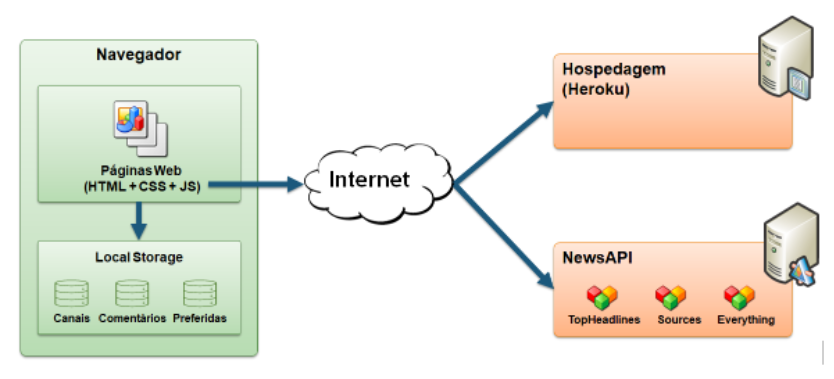
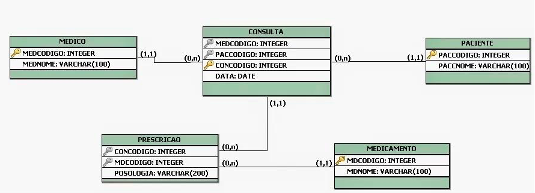

# 4. Arquitetura e Projeto da Solução

<span style="color:red">Pré-requisitos: <a href="04-Modelagem do Processo de Negocio.md"> Modelagem do Processo de Negocio</a></span>

Nesta etapa, a equipe traduzirá os processos e requisitos mapeados anteriormente em uma arquitetura de software funcional, definindo o ecossistema tecnológico, a interface com o usuário, o modelo de dados e a infraestrutura do projeto.

---

## 4.1. Tecnologias Utilizadas
Descreva o ecossistema tecnológico adotado pela equipe para implementar a solução (linguagens, frameworks, bibliotecas, SGBD, ferramentas de versionamento e IDEs). 


| Dimensão | Tecnologia / Ferramenta |
| :--- | :--- |
| **SGBD** | MySQL / PostgreSQL |
| **Front-end** | HTML, CSS, JavaScript (ou Framework escolhido) |
| **Back-end** | Java Spring Boot / Node.js / Python |
| **Deploy / Hospedagem** | GitHub Pages / Render / Vercel |
| **Gerenciamento de Projeto** | GitHub Projects (Sprints) |

---

## 4.2. Arquitetura da Solução
A arquitetura da solução descreve a organização estrutural do sistema, detalhando os módulos, componentes e a forma como eles se comunicam com base nas tecnologias escolhidas.

 

> ✏️ **[Atenção aluno: Insira o diagrama de arquitetura da solução abaixo e discorra sobre ele]**
> *Descreva aqui os módulos que compõem o sistema e explique o fluxo de comunicação ilustrado no diagrama.*

---

## 4.3. Wireframes (Esquemáticas de Tela)
Os wireframes estruturam o layout, a disposição dos elementos e a experiência de uso (*User Experience*), definindo de forma esquemática a interface visual antes de iniciar a codificação. Eles devem refletir as interações necessárias para atender às Histórias de Usuário e aos Requisitos Funcionais, materializando graficamente o fluxo que a persona executará no sistema.


> ✏️ **[Atenção aluno: Insira os protótipos/wireframes das principais telas da aplicação abaixo. Aluno você deve apagar a Figura de Exemplo para evitar poluição visual da documentação.]**
> 
> *Lembre-se de informar qual Requisito Funcional corresponde a tela (wiereframe apresentada na documentação).*
> 


---

## 4.4. Modelo de Dados
O desenvolvimento da solução requer uma base de dados integrada que permita efetuar cadastros e controles associados aos processos mapeados. 

### 4.4.1. Modelo Entidade-Relacionamento (MER)
O Modelo ER representa graficamente como as entidades (objetos de negócio) se relacionam entre si na aplicação.


> ✏️ **[Atenção aluno: Insira a imagem do Diagrama Entidade-Relacionamento (DER) integrado aqui. Aluno você deve apagar a Figura de Exemplo para evitar poluição visual da documentação]**
> 


### 4.4.2. Esquema Relacional
O Esquema Relacional corresponde à representação estruturada dos dados em tabelas, especificando chaves primárias e estrangeiras.


> ✏️ **[Atenção aluno: Insira o diagrama ou a representação textual do Esquema Relacional aqui. Aluno você deve apagar a Figura de Exemplo para evitar poluição visual da documentação]**

### 4.4.3. Modelo Físico (Script SQL)
O script de criação das tabelas do banco de dados deve ser versionado no diretório `src/bd/` do repositório.

> ✏️ **[Atenção aluno: Insira o script SQL ou a referência do arquivo abaixo]**

```sql
-- Exemplo de Script SQL Base
CREATE TABLE Usuario (
    UsuId INT AUTO_INCREMENT PRIMARY KEY,
    UsuNome VARCHAR(100) NOT NULL,
    UsuEmail VARCHAR(100) UNIQUE NOT NULL
);


